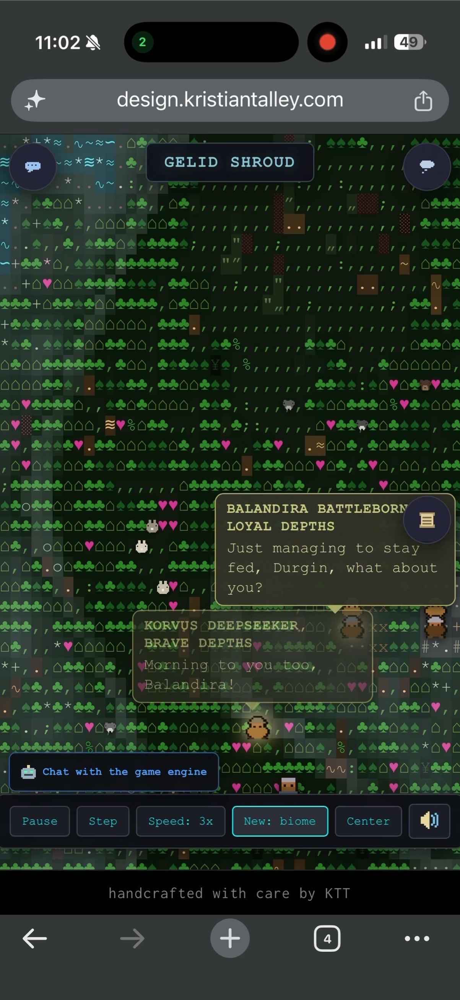
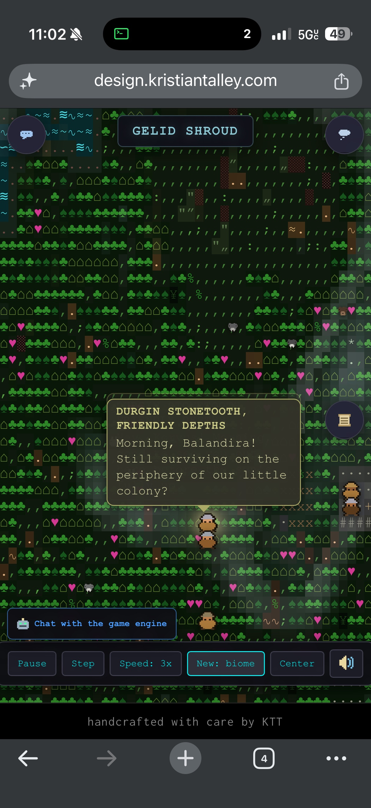
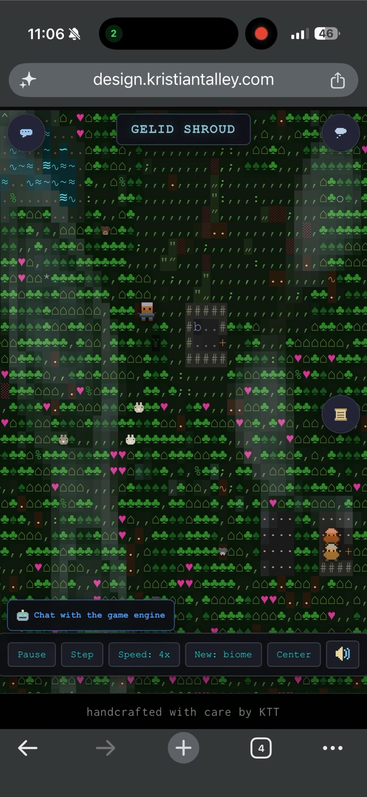

# LLM Fortress Clone

**An emergent, agent-based simulation inspired by Dwarf Fortress, powered by deterministic systems and self-hosted LLM cognition**

<p align="center">
  
</p>

<p align="center"><em>Eirabell and Baragor weigh their options in the Sage Miresteppes — every line generated live by a self-hosted LLM reading their traits, mood, and the world around them.</em></p>

---

## Overview

This project is a **browser-based, agent-driven simulation** inspired by *Dwarf Fortress* and *RimWorld*, built as an experiment in **emergent behavior, social simulation, and LLM-assisted cognition**.

Rather than using large language models to *replace* game logic or narrate outcomes, this project treats LLMs as **bounded cognitive layers** inside a deterministic world:

> The simulation is authoritative.
> The agents reason about it.

Each dwarf exists as an autonomous entity with:

* needs (hunger, fulfillment, survival)
* traits and skills
* internal thoughts
* social interactions
* imperfect, local knowledge of the world

The result is a system where **stories emerge from mechanics**, not scripts.

---

## Key Systems

- **13-step tick loop** — scent diffusion → hunger → drives → decisions → actions → visitors → combat → social → events → history → cleanup + weather + behavior traces
- **Rich personality system** — 10 traits (0–1 range) feed into 6 archetypes, 8 skills, mood, drives, and relationship affinity
- **Entity cognition via LLM** — thoughts on meetings, food, hunger, observations; conversations up to 6 turns with cooldowns; layered world context (L0 lore + L1 chronicle)
- **Procedural world gen** — Simplex noise for elevation/moisture/temperature → biome classification, cellular automata caves, scent-based pathfinding, landmarks
- **Two chat modes** — talk directly to any entity (shaped by their personality/mood/relationships), or talk to the game engine itself for world analysis
- **Visitor system** — traders, raiders, wanderers with itineraries, A* pathing, disposition and satisfaction state machines
- **Animal ecosystem** — autonomous animals with AI, intentions, and predator/prey behaviors
- **Hunting & fishing** — food gathering mechanics integrated into the food web
- **Crafting system** — workshop jobs and item creation, fueled by hunting loot
- **Persistent weather** — mud season, snow accumulation, wetness grids, weather-driven shelter-seeking
- **8-bit sprite engine** — emoji replacement with pixel-art style sprites at half-humanoid scale
- **Camera system** — pan policy, follow policy, centered view on dwarves
- **Day/night rhythm** — time-of-day awareness affecting entity behavior and world state
- **Skill level-up system** — entity skills improve through use, tracked in chronicle
- **Behavior traces** — per-entity behavioral history for richer LLM context

---

## Design Philosophy

### 1. Simulation First, LLM Second

The world runs independently of any language model.

* Movement, hunger, resources, time, and physics are **fully deterministic**
* The simulation advances on discrete ticks
* Agents must obey world constraints

LLMs are used **only** for:

* internal thought generation
* subjective interpretation
* social expression (speech, opinions, reactions)
* name and biography generation
* biome naming and color theming

They cannot:

* spawn resources
* override rules
* teleport agents
* resolve conflicts magically

If the LLM fails or is disabled, the simulation still runs with local fallbacks.

---

### 2. Agents, Not Chatbots

Dwarves are **agents**, not conversational NPCs.

Each agent operates in a task-driven cognitive loop:

```
sense → evaluate priorities → select task → execute → reflect
```

* *Sense*: observe local world state (nearby entities, food, threats)
* *Evaluate*: score candidate tasks by priority (hunger, social needs, work)
* *Select*: pick highest-priority task
* *Execute*: perform allowed actions (move, eat, work, socialize)
* *Reflect*: update internal state and relationships

This loop is intentionally imperfect and lossy—agents misunderstand, forget, and behave inconsistently.

<p align="center">
  
</p>

<p align="center"><em>Korvus and Balandira trade words unprompted — emergent dialogue between two agents, not scripted NPC barks.</em></p>

---

### 3. Emergence Over Authoring

No stories are written in advance.

* There are no scripted quests
* No predefined personalities
* No forced narrative arcs

Instead:

* small rules interact
* agents collide socially
* meaning emerges from constraint

This mirrors the design ethos of classic simulation games and agent-based modeling.

---

### 4. Local, Self-Hosted AI

All LLM functionality runs through a **self-hosted Ollama server**.

There are:

* no cloud dependencies
* no required third-party APIs
* no external data sharing

This keeps the system:

* fast
* private
* hackable
* deterministic at the simulation layer

LLMs are treated as **replaceable components**, not hard dependencies.

---

## Features

* **LLM-assisted cognition** (thoughts, speech, interpretation) with layered context (L0 lore + L1 chronicle)
* **Autonomous dwarf agents** with traits, skills, needs, and behavioral traces
* **Autonomous animal agents** with intentions and predator/prey behaviors
* **Hunger and survival systems** driven by world state
* **Hunting and fishing** mechanics for food gathering
* **Crafting system** — workshop jobs and item creation
* **Procedurally generated maps and biomes** (noise-based terrain, cellular automata caves, landmarks)
* **Deterministic simulation loop** (13-step tick)
* **Social interactions and conversations** with relationship history
* **External visitors** (humans, goblins, elves with itineraries and A* pathing)
* **World history generation** with race relations
* **Persistent weather** — mud season, snow accumulation, wetness grids
* **Day/night rhythm** affecting entity behavior
* **8-bit sprite engine** replacing entity emojis
* **Camera pan and follow** policies
* **Skill level-up system** with chronicle events
* **Behavior traces** for richer entity context
* **Experimental / research-friendly architecture**
* **Runs entirely in the browser**

### Two Ways to Interact

<table>
  <tr>
    <td width="50%" align="center"></td>
    <td width="50%" align="center"></td>
  </tr>
  <tr>
    <td align="center"><strong>Talk to a character</strong><br>Durgin answers in a voice shaped by his personality, mood, and relationships.</td>
    <td align="center"><strong>Talk to the game engine</strong><br>Ask the read-only analyst about world state, history, and how the simulation is built.</td>
  </tr>
</table>

---

## Tech Stack

* **JavaScript (ES Modules)**
* **Vite** for development and bundling
* **HTML / CSS Grid** for ASCII rendering
* **Rot.js** for weather and flora animation
* **Ollama** (primary, local) or **Groq** (cloud fallback) for LLM inference
* No frameworks, no engines, minimal abstraction

---

## Architecture Overview

### High-Level System Diagram

```
┌─────────────────────────────────────────────────────────────────────┐
│                          BROWSER CLIENT                              │
├─────────────────────────────────────────────────────────────────────┤
│                                                                      │
│  ┌──────────────┐    ┌──────────────┐    ┌──────────────────────┐  │
│  │   Renderer   │    │   Widgets    │    │    Event Bus         │  │
│  │  (ASCII Grid)│    │ (UI Panels)  │    │  (Pub/Sub System)    │  │
│  └──────┬───────┘    └──────┬───────┘    └──────────┬───────────┘  │
│         │                   │                       │               │
│         └───────────────────┼───────────────────────┘               │
│                             │                                        │
│                    ┌────────▼────────┐                              │
│                    │   World State   │                              │
│                    │  (Single Source │                              │
│                    │   of Truth)     │                              │
│                    └────────┬────────┘                              │
│                             │                                        │
│         ┌───────────────────┼───────────────────┐                   │
│         │                   │                   │                   │
│  ┌──────▼──────┐    ┌──────▼──────┐    ┌──────▼──────┐            │
│  │  Simulation │    │   AI/Agent  │    │   Thought   │            │
│  │    Loop     │    │   Decision  │    │   System    │            │
│  │  (tick.js)  │    │  (dwarfAI)  │    │ (thoughts)  │            │
│  └──────┬──────┘    └─────────────┘    └──────┬──────┘            │
│         │                                      │                    │
│         │                              ┌───────▼───────┐           │
│         │                              │  LLM Client   │───────────┼──► Ollama Server
│         │                              │  (Async Queue)│           │
│         │                              └───────────────┘           │
│         │                                                           │
│  ┌──────▼──────────────────────────────────────────────────┐       │
│  │                    Map Generation                        │       │
│  │  (Noise, Cellular Automata, Biome Classification)       │       │
│  └─────────────────────────────────────────────────────────┘       │
│                                                                      │
└─────────────────────────────────────────────────────────────────────┘
```

---

## Project Structure

```
src/
├── ai/                    # Agent cognition and LLM integration
│   ├── dwarfAI.js         # Decision-making, task selection
│   ├── visitorAI.js       # External visitor behaviors
│   ├── animalAI.js        # Animal autonomous behaviors
│   ├── intentions.js      # Agent intention system
│   ├── itineraries.js     # Visitor travel routes
│   ├── thoughts.js        # Event-driven thought generation
│   └── llmClient.js       # Groq/Ollama API, request queue
│
├── llm/                   # LLM-specific generators
│   ├── nameGenerator.js   # Dwarf names and biographies
│   ├── biomeGenerator.js  # Biome names and color modifiers
│   ├── entityChat.js      # Player-to-entity conversations
│   ├── gameAssistant.js   # "Ask the Game" feature
│   ├── eventNarrator.js   # Live event narration
│   ├── worldContext.js    # Layered LLM context (L0+L1)
│   ├── fallbacks.js       # Local fallback responses
│   └── prompts/           # LLM prompt templates
│       ├── dwarf.js
│       ├── narrative.js
│       ├── entityChat.js
│       └── scenarios.js
│
├── sim/                   # Core simulation systems
│   ├── world.js           # Main tick loop (13-step orchestration)
│   ├── entities.js        # Dwarf/food/visitor creation
│   ├── animals.js         # Animal entity management
│   ├── movement.js        # A* pathfinding, scent maps
│   ├── combat.js          # Combat resolution
│   ├── rules.js           # Hunger, death, food production
│   ├── tasks.js           # Task types and skill system
│   ├── jobs.js            # Job assignment & management
│   ├── construction.js    # Building and digging
│   ├── crafting.js        # Workshop jobs & item creation
│   ├── visitors.js        # Visitor entity management
│   ├── visitorSpawner.js  # External force generation
│   ├── races.js           # Race definitions (dwarf, human, goblin, elf)
│   ├── foodProduction.js  # Farms, fishing, food systems
│   ├── hunting.js         # Hunting mechanics
│   ├── fishing.js         # Fishing mechanics
│   ├── history.js         # World history & race relations
│   ├── edges.js           # Map boundary & fortress detection
│   ├── landmarks.js       # Navigation landmarks
│   ├── weather.js         # Weather state machine
│   ├── weatherParticles.js # Weather particle effects
│   ├── weatherScenarios.js # Weather scenario definitions
│   ├── weatherCognition.js # Weather-driven behavior
│   ├── weatherRenderer.js # Weather visual rendering
│   ├── clock.js           # Day/night rhythm
│   ├── drives.js          # Entity drive system
│   ├── perception.js      # Entity perception system
│   ├── capabilities.js    # Entity capabilities
│   ├── behaviorTrace.js   # Behavioral history tracking
│   ├── groundCover.js     # Terrain ground cover
│
├── map/                   # Procedural generation
│   ├── map.js             # Map creation, tile management
│   ├── noise.js           # Simplex, FBM, ridged noise
│   ├── biomes.js          # Biome classification
│   ├── tiles.js           # Tile definitions, HSL color utilities
│   └── mapConfig.js       # Map generation parameters
│
├── scenarios/             # Pre-built game scenarios
│   ├── presets.js         # 10 hand-crafted scenarios
│   └── scenarioSchema.js  # Validation & parameter ranges
│
├── ui/                    # Rendering and interface
│   ├── renderer.js        # CSS Grid ASCII renderer (dirty-checked)
│   ├── sprites.js         # 8-bit sprite engine
│   ├── statPanel.js       # Entity inspection panel
│   ├── speechBubble.js    # Floating thoughts/speech + sidebar
│   ├── biomeWidgets.js    # Title and event log widgets
│   ├── controlsWidget.js  # Play/pause/speed controls
│   ├── gameAssistantPanel.js # "Ask the Game" chat panel
│   ├── inspection.js      # Position inspection utilities
│   ├── cursor.js          # Grid-snapping cursor system
│   ├── log.js             # Event log management
│   ├── logDisplay.js      # Event log rendering
│   ├── conversationToast.js # Toast notifications
│   ├── speech.js          # Speech generation utilities
│   ├── scenarioScreen.js  # Scenario selection screen
│   ├── loadingProgress.js # Loading progress indicator
│   ├── music.js           # Ambient music
│   └── weatherRenderer.js # Weather visual effects
│
├── state/                 # State management
│   └── store.js           # World state schema, log management
│
├── events/                # Communication
│   └── eventBus.js        # Pub/sub event system
│
├── utils/                 # Utilities
│   ├── worldCompressor.js # State serialization
│   └── gameContextCompressor.js # Context for LLM
│
└── map_generators/        # Alternative generators
    └── cellular_automata.js # Cave generation via CA

styles/                    # CSS
index.html                 # Entry point
src/main.js               # Initialization and game loop
```

---

## Simulation Flow

### Main Tick Loop

The simulation advances through discrete ticks, with each tick executing systems in a deterministic order:

```
┌─────────────────────────────────────────────────────────┐
│                    TICK EXECUTION                        │
├─────────────────────────────────────────────────────────┤
│                                                          │
│  1. WEATHER UPDATE                                       │
│     ├─ Advance weather state machine                     │
│     └─ Update ground cover (snow/wetness persistence)    │
│                                                          │
│  2. SCENT UPDATE                                         │
│     ├─ Decay existing scents                             │
│     ├─ Emit food scents                                  │
│     └─ Emit presence scents (dwarf movement trails)      │
│                                                          │
│  3. DRIVE DECAY & HOMEOSTASIS                            │
│     ├─ Decay all entity drives                           │
│     ├─ Mood homeostasis (drift toward setpoint)          │
│     └─ Energy drain during wakefulness                   │
│                                                          │
│  4. HUNGER PROCESSING                                    │
│     ├─ Increase hunger                                   │
│     └─ Emit threshold events                             │
│                                                          │
│  5. PERCEPTION                                           │
│     ├─ Update entity awareness of local world            │
│     └─ Update at decision intervals                      │
│                                                          │
│  6. DECISION PHASE (per entity)                         │
│     ├─ Check combat threats → respond if needed          │
│     ├─ Check critical hunger → seek food                 │
│     ├─ Evaluate task priorities                          │
│     └─ Select highest-priority task                      │
│                                                          │
│  7. ACTION PHASE (per entity)                           │
│     └─ Execute movement, eating, working, socializing    │
│                                                          │
│  8. BEHAVIOR TRACE SAMPLING                              │
│     └─ Record recent actions for LLM context             │
│                                                          │
│  9. ANIMAL ECOSYSTEM                                     │
│     ├─ Decay drives, age, perceive, decide, act          │
│     └─ Convert fallen animals to carcasses               │
│                                                          │
│  10. VISITOR PROCESSING                                   │
│      └─ Update trader/raider behaviors                    │
│                                                          │
│  11. COMBAT RESOLUTION                                    │
│      └─ Resolve attacks, apply damage                     │
│                                                          │
│  12. DEATH PROCESSING                                     │
│       ├─ Remove dead entities                            │
│       └─ Emit death events                                │
│                                                          │
│  13. RESOURCE UPDATES                                     │
│       ├─ Food production at farms                        │
│       ├─ Queue crafting jobs                             │
│       └─ Random food spawning                            │
│                                                          │
│  14. VISITOR SPAWNING                                     │
│       └─ Maybe spawn traders/raiders based on relations  │
│                                                          │
│  15. MOOD DETECTION                                       │
│       └─ Emit events for significant mood changes        │
│                                                          │
│  16. EMIT TICK EVENT                                      │
│       └─ Notify all subscribers                           │
│                                                          │
└─────────────────────────────────────────────────────────┘
```

**Implementation**: `src/sim/world.js` → `tick()` function

---

## Agent Architecture

### Dwarf Decision System

Dwarves use a **priority-based task selection** system, not a behavior tree or state machine:

```
┌─────────────────────────────────────────────────────────┐
│                 DECISION FLOW                            │
├─────────────────────────────────────────────────────────┤
│                                                          │
│  ┌──────────────────┐                                   │
│  │ Combat Threat?   │──YES──► decideCombatResponse()    │
│  └────────┬─────────┘                                   │
│           │ NO                                           │
│  ┌────────▼─────────┐                                   │
│  │ Hunger > 85?     │──YES──► decideCritical() [food]   │
│  └────────┬─────────┘                                   │
│           │ NO                                           │
│  ┌────────▼─────────┐                                   │
│  │ Has Active Task? │──YES──► Continue (if < 20 ticks)  │
│  └────────┬─────────┘                                   │
│           │ NO                                           │
│  ┌────────▼─────────┐                                   │
│  │  findNewTask()   │                                   │
│  │                  │                                   │
│  │  Evaluate:       │                                   │
│  │  - Hunger need   │ Priority 60+                      │
│  │  - Social need   │ Priority 50+                      │
│  │  - Aspiration    │ Priority 55+                      │
│  │  - Exploration   │ Priority 45+                      │
│  │  - Available work│ Priority 40-45                    │
│  │  - Idle fallback │ Priority 10                       │
│  │                  │                                   │
│  │  → Pick highest  │                                   │
│  └──────────────────┘                                   │
│                                                          │
└─────────────────────────────────────────────────────────┘
```

**Implementation**: `src/ai/dwarfAI.js` → `decide()` and `findNewTask()` functions

### Movement System

Dwarves navigate using **A* pathfinding** with scent-based routing and multiple weighted factors:

```
Movement Weight Composition:
├── Momentum (40%)      - Prefer continuing previous direction
├── Scent gradient (30%)- Follow attractive scents (food)
├── Social (25%)        - Approach/avoid other dwarves
├── Exploration (20%)   - Explore unmapped areas
└── Wander noise (15%)  - Random deviation for naturalism

Scent System:
├── Multi-channel scents (food, presence, danger)
├── Emitted from food sources with strength × radius decay
├── Spreads outward with exponential decay
├── Dwarves sample scent gradient in 8 directions
└── Global decay: 2% per tick
```

**Implementation**: `src/sim/movement.js`

### Animal Decision System

Animals operate on a parallel cognitive loop with faster decision intervals:

```
Animal Tick:
├── Every tick: decay drives, age, act
├── Every N ticks: perceive, update fear, decide
└── On death: convert to food source, emit danger scent
```

Animals have predator/prey behaviors, fear responses to dwarves and other animals, and age-based lifecycle management.

**Implementation**: `src/ai/animalAI.js`, `src/sim/animals.js`

### Dwarf States

```
IDLE, WANDERING, SEEKING_FOOD, EATING,
SEEKING_SOCIAL, SOCIALIZING, EXPLORING,
WORKING_DIG, WORKING_BUILD, WORKING_CRAFT,
HAULING, FIGHTING, FLEEING_COMBAT, SLEEPING, GATHERING
```

### Entity Schema

Each dwarf contains:

```javascript
{
  // Identity
  id, name, generatedName,

  // Position
  x, y, state, target,

  // Vitals
  hunger: 0-95,
  mood: 0-100,
  hp, maxHp,
  energy: 0-100,         // Drains while awake, recovers during sleep

  // Personality (0-1 traits)
  personality: {
    curiosity, friendliness, bravery, humor,
    melancholy, patience, creativity, loyalty,
    stubbornness, optimism
  },

  // Drives (0-1 intensity)
  drives: {
    hunger, social, exploration, safety,
    curiosity, comfort
  },

  // Skills (0-1 proficiency)
  skills: { mining, masonry, crafting, cooking, combat, ... },

  // Psychology
  aspiration: enum,
  fulfillment: { social, exploration, creativity, tranquility },

  // Social
  relationships: {
    [dwarfId]: { affinity, interactions, conversationLog }
  },

  // Memory
  memory: { visitedAreas, events, conversations },

  // Behavior traces (ring buffer for LLM context)
  behaviorTrace: {
    recentActions: [...],
    decisions: [...],
    tick: number
  },

  // Decision timing
  decisionTick: number,
  decisionInterval: number,

  // Current state
  currentTask, currentThought, lastThoughtTick
}
```

### Animal Entity Schema

Animals have a simplified schema focused on survival behaviors:

```javascript
{
  id, type, x, y, hp, state,
  hunger, energy, age, maxAge,
  fear: 0-1,
  decisionInterval: 5-15,
  skills: { running, strength, stealth },
  behaviorTrace: { recentActions: [...] }
}
```

---

## LLM Integration

### Integration Points

The LLM is called in **7 specific places**, all outside the main tick loop:

```
┌─────────────────────────────────────────────────────────┐
│              LLM INTEGRATION POINTS                      │
├─────────────────────────────────────────────────────────┤
│                                                          │
│  1. THOUGHT GENERATION (src/ai/thoughts.js)             │
│     ├─ Trigger: Meeting, food found, hunger, mood       │
│     ├─ Async, non-blocking                              │
│     └─ Fallback: Generic thought templates              │
│                                                          │
│  2. SPEECH GENERATION (src/ai/thoughts.js)              │
│     ├─ Trigger: Social interaction with another dwarf   │
│     ├─ Context: Relationship history, current thought   │
│     └─ Fallback: Scripted phrases                       │
│                                                          │
│  3. NAME/BIO GENERATION (src/llm/nameGenerator.js)      │
│     ├─ Trigger: World initialization                    │
│     ├─ Batch generation for all dwarves                 │
│     └─ Fallback: Local name pool                        │
│                                                          │
│  4. BIOME NAMING (src/llm/biomeGenerator.js)            │
│     ├─ Trigger: Map generation                          │
│     ├─ Input: Climate parameters                        │
│     └─ Fallback: 27 preset biome names                  │
│                                                          │
│  5. GAME ASSISTANT (src/llm/gameAssistant.js)           │
│     ├─ Trigger: Player query via UI                     │
│     └─ Optional feature, not part of simulation         │
│                                                          │
│  6. EVENT NARRATION (src/llm/eventNarrator.js)          │
│     ├─ Trigger: Significant world events                │
│     ├─ Context: Layered world state (L0+L1)             │
│     └─ Fallback: Generic event descriptions             │
│                                                          │
│  7. SCENARIO GENERATION (src/llm/scenarioGenerator.js)  │
│     ├─ Trigger: Player requests new scenario            │
│     ├─ Output: JSON with title, description, params     │
│     └─ Fallback: Preset scenarios                       │
│                                                          │
└─────────────────────────────────────────────────────────┘
```

### Layered World Context

LLM prompts use layered context for richer responses:
- **L0 (Lore)**: Permanent world history, race relations, geography
- **L1 (Chronicle)**: Recent events, tick history, current situation

### Hard Constraints

* **No LLM calls inside `tick()` loop**
* LLMs only suggest actions, never mutate state directly
* All systems degrade gracefully with local fallbacks
* Request queue limits concurrent calls (max 10)

### LLM Client Architecture

```
src/ai/llmClient.js
├─ Server: Ollama (primary, local) or Groq (cloud fallback)
├─ Model: llama3.1-claude or any Ollama-compatible
├─ Queue: Async, non-blocking, rate-limited
└─ Functions:
   ├─ queueGeneration(prompt, options)
   ├─ checkConnection()
   └─ checkLLMHealth()
```

---

## Event System

### Event-Driven Architecture

The simulation uses a **pub/sub event bus** for loose coupling between systems:

```javascript
// src/events/eventBus.js

// Subscribe
const unsubscribe = on(EVENTS.FOOD_FOUND, (payload) => { ... });

// Emit
emit(EVENTS.FOOD_FOUND, { dwarf, food });
```

### Event Types

**Social Events** (trigger LLM thoughts):
- `DWARF_MEETING` - Two dwarves within 4 tiles
- `DWARF_PARTING` - Dwarves move apart

**Discovery Events**:
- `FOOD_FOUND` - Dwarf finds food source
- `FOOD_DEPLETED` - Food source exhausted
- `NEW_TERRAIN` - Dwarf enters different biome

**State Change Events**:
- `HUNGER_THRESHOLD` - Hunger crosses 40/60/80
- `MOOD_SHIFT` - Mood changes > 15 points

**World Events**:
- `DWARF_DEATH`, `DWARF_SPAWN`
- `VISITOR_ARRIVED`, `VISITOR_LEAVING`
- `COMBAT_HIT`, `COMBAT_MISS`, `COMBAT_FLEE`
- `TICK` - Every simulation tick

---

## Weather System

### Persistent Weather Model

Weather is not cosmetic — it persists across ticks and affects the world state:

```
Weather State Machine:
┌──────────┐     ┌──────────┐     ┌──────────┐
│  CLEAR   │────►│  RAIN    │────►│  SNOW    │
└──────────┘     └──────────┘     └──────────┘
     │                │                │
     └────────────────┴────────────────┘
              (transitions based on season)
```

### Mud Season (Ground Cover Persistence)

The ground remembers weather conditions (audit WX 7):
- Rain soaks into the ground (wetness)
- Snow accumulates on surfaces
- Thaw creates mud (wet + cold transition)

This affects entity movement, comfort, and LLM context.

### Weather Cognition

Entities perceive and react to weather:
- Shelter-seeking during storms
- Weather-driven mood changes
- LLM prompts include weather context

### Weather Rendering

Particle-based weather effects rendered on top of the ASCII grid:
- Rain particles
- Snow accumulation visualization
- Storm intensity variation

**Implementation**: `src/sim/weather.js`, `src/sim/weatherParticles.js`, `src/sim/weatherScenarios.js`, `src/sim/weatherCognition.js`, `src/ui/weatherRenderer.js`

---

## Map Generation

### Three Generation Modes

1. **Biome Map** (default)
   - Perlin/Simplex noise for elevation, moisture, temperature
   - River generation via pathfinding
   - Biome classification determines tile types

2. **Mixed Map**
   - Hybrid surface/underground
   - Cellular automata caves with surface skylights

3. **Cave Map**
   - Pure cellular automata (4-5 smoothing rule)
   - Mushroom groves and water pools

### Noise System

```
src/map/noise.js
├─ Simplex Noise    - Base terrain variation
├─ FBM              - Multi-octave detail
├─ Ridged Noise     - Mountain peaks
└─ Warped Noise     - Organic distortion
```

### Biome Color System

Each biome applies HSL color modifiers to the base tile palette, creating unique visual themes:

```
Color Modification Pipeline:
┌─────────────┐     ┌─────────────┐     ┌─────────────┐
│ Base Tile   │ ──► │ HSL Convert │ ──► │ Apply Mods  │ ──► Final Color
│ (hex colors)│     │             │     │ (hue/sat/lt)│
└─────────────┘     └─────────────┘     └─────────────┘

Modifier Ranges (-30 to +30):
├── Hue:        Blue shift (cold) ◄──► Orange shift (hot)
├── Saturation: Desaturated (dry) ◄──► Vivid (wet)
└── Brightness: Darker (forests)  ◄──► Brighter (deserts)
```

**27 Preset Biomes** organized by climate signature (temperature × moisture × elevation):
- Cold: Arctic Tundra, Frozen Alpine Peaks, Boreal Taiga, etc.
- Temperate: Temperate Woodland, Alpine Meadow, Cloud Forest, etc.
- Hot: Desert Wasteland, Tropical Rainforest, Volcanic Highlands, etc.

**Implementation**: `src/llm/biomeGenerator.js`, `src/map/tiles.js` → `shiftColor()`

---

## Rendering

### ASCII Renderer

The renderer uses **CSS Grid** with one `<span>` per map cell:

```
src/ui/renderer.js
├─ createRenderer(container, width, height)
├─ render(map, entities)        # Dirty-checked updates
├─ buildRenderEntities(state)   # Extract visible objects
└─ scrollToDwarves(dwarves)     # Center view on dwarves
```

### Camera System

Camera follows dwarves with configurable pan policy:
- **Follow mode**: Center on active dwarves
- **Pan policy**: Smooth camera movement, centered view

### Sprite Engine

8-bit pixel-art sprites replace entity emojis:
- Dwarves, animals, and visitors rendered as sprites
- Half-humanoid scale for animals
- State-based sprite selection (healthy, hungry, fighting, etc.)

**Implementation**: `src/ui/sprites.js`

### Entity Glyphs (fallback/emoji mode)

| Entity | Glyph | Color |
|--------|-------|-------|
| Dwarf (healthy) | `🧌` | Yellow |
| Dwarf (hungry) | `🧌` | Orange |
| Dwarf (starving) | `🧌` | Red |
| Food | `%` | Green |
| Human | `🧙‍♂️` | Tan |
| Goblin | `👹` | Green |
| Elf | `🧝🏻‍♀️` | Blue |

### UI Widgets

- **Stat Panel** - Entity inspection on click
- **Speech Bubbles** - Floating above speaking dwarves, centered tails
- **Thought Sidebar** - Recent dwarf thoughts
- **Event Log** - World events
- **Chronicle** - Skill level-up and significant events
- **Biome Title** - Map name with color theming
- **Controls** - Pause, speed, regenerate
- **Game Assistant** - "Ask the Game" chat panel
- **Scenario Screen** - Scenario selection interface
- **Loading Progress** - Initialization progress indicator
- **Weather Renderer** - Particle-based weather effects
- **Music** - Ambient audio

---

## External Forces & Visitors

### Visitor System

External entities (humans, goblins, elves) visit based on world history and race relations:

```
Visitor Lifecycle:
┌────────────┐     ┌────────────┐     ┌────────────┐     ┌────────────┐
│  ARRIVING  │ ──► │  ACTIVE    │ ──► │  LEAVING   │ ──► │   GONE     │
│ (map edge) │     │(trade/raid)│     │ (satisfied)│     │            │
└────────────┘     └────────────┘     └────────────┘     └────────────┘
       │                │
       │                ▼
       │         ┌────────────┐
       └────────►│  FIGHTING  │ ◄──► FLEEING
                 └────────────┘
```

### Visitor Itineraries

Visitors follow planned routes through the world:
- Pre-computed itineraries based on map landmarks
- A* pathfinding for navigation
- Dynamic route adjustment based on threats

**Implementation**: `src/ai/itineraries.js`, `src/sim/movement.js`


---

## Animal Ecosystem

### Autonomous Animal Agents

Animals operate as independent agents with their own cognitive loop:

```
Animal Tick:
├── Every tick: decay drives, age, act
├── Every N ticks: perceive, update fear, decide
└── On death: convert to food source, emit danger scent
```

### Animal Behaviors

- **Predator/prey dynamics** - animals flee from threats, hunt when hungry
- **Fear responses** - fear level affects decision-making and movement
- **Aging lifecycle** - animals grow, mature, and eventually die
- **Carcass conversion** - fallen animals become food sources for dwarves

### Animal Types

| Type | Behavior | Disposition |
|------|----------|-------------|
| Deer | Herd behavior, flee from threats | Passive |
| Wolf | Pack hunting, aggressive | Predatory |
| Bird | Roaming, low priority | Neutral |

**Implementation**: `src/ai/animalAI.js`, `src/sim/animals.js`

---


---

## Hunting & Crafting

### Hunting Mechanics

Dwarves can hunt animals for food and materials:
- Track and pursue animal targets
- Successful hunts yield meat and hides
- Hunted food sources are tracked like other food

**Implementation**: `src/sim/hunting.js`

### Fishing Mechanics

Dwarves can fish in water sources:
- Fish from nearby water tiles
- Fishing provides reliable food source
- Weather affects fishing success

**Implementation**: `src/sim/fishing.js`

### Crafting System

Workshop-based item creation from gathered materials:
- Crafting jobs queued when materials + workshops available
- Loot from hunting fuels the crafting loop
- Items created can be used, traded, or stored

**Implementation**: `src/sim/crafting.js`

---

### Races & Roles

| Race | Roles | Typical Disposition |
|------|-------|---------------------|
| Human | Merchant, Caravan Guard, Diplomat | Neutral-Friendly |
| Goblin | Scout, Raider | Hostile |
| Elf | Scout, Missionary | Neutral |

### World History

Race relations are determined by procedurally generated historical events:

- **WAR** (-30 relation) / **ALLIANCE** (+35)
- **TRADE_AGREEMENT** (+15) / **BETRAYAL** (-40)
- **RELIGIOUS_CONFLICT** (-20) / **CULTURAL_EXCHANGE** (+10)

These affect visitor spawn rates and initial dispositions.

**Implementation**: `src/sim/history.js`, `src/sim/visitorSpawner.js`, `src/ai/visitorAI.js`

---

## Scenario System

### Pre-Built Scenarios

The game includes **10 hand-crafted preset scenarios** with varying difficulty and terrain:

| Scenario | Terrain | Difficulty | Description |
|----------|---------|------------|-------------|
| Mountain Stronghold | Biome | Harsh | Frozen peaks, scarce resources |
| Verdant Valley | Biome | Peaceful | Abundant forest, thriving commune |
| Cavern Delvers | Cave | Normal | Underground expedition |
| Desert Nomads | Biome | Harsh | Arid waste survival |
| The Last Colony | Mixed | Brutal | Post-disaster rebuilding |
| Marshland Settlers | Biome | Normal | Wetland settlement |
| Expedition Prime | Mixed | Normal | Exploration-focused |
| Fungal Kingdom | Cave | Peaceful | Giant mushroom caves |
| Frozen Depths | Cave | Harsh | Ice caverns |
| River Crossing | Biome | Normal | Valley with central river |

### Scenario Parameters

Each scenario configures:

```javascript
{
  terrain: 'biome' | 'mixed' | 'cave',
  biomeEmphasis: 'mountain' | 'forest' | 'marsh' | 'desert' | 'balanced',
  difficulty: 'peaceful' | 'normal' | 'harsh' | 'brutal',
  mapWidth: 40-100,        // Grid cells
  mapHeight: 16-40,        // Grid cells
  dwarfCount: 3-20,        // Starting population
  initialFood: 500-5000,   // Starting food amount
  foodSources: 5-30,       // Food spawn points
  hungerRate: 0.5-3.0,     // Hunger multiplier
  foodRespawnRate: 0.5-2.0 // Food regeneration
}
```

**Implementation**: `src/scenarios/presets.js`, `src/scenarios/scenarioSchema.js`

### LLM Scenario Generation

The "Flavor" button triggers LLM-based scenario generation:
- Generates themed scenarios (mountain survival, valley commune, cave expedition, etc.)
- Returns valid JSON with title, description, parameters, and victory conditions
- Falls back to preset scenarios if LLM unavailable

**Implementation**: `src/llm/scenarioGenerator.js`, `src/llm/prompts/scenarios.js`

### Session Color Palette

Each page load generates a unique **duotone complementary HSL palette**:

```
Palette Structure:
├── Primary     - Base hue, moderate saturation
├── Secondary   - Complementary hue (180° opposite)
├── Tertiary    - Analogous hue (+30°)
├── Quaternary  - Triadic offset (+60°)
└── Quinary     - Complement analogous (complement +30°)
```

The palette influences biome color modifiers for unique visual themes on every session.

**Implementation**: `src/llm/scenarioGenerator.js` → `generateDuotonePalette()`, `paletteToBiomeColorMod()`

---

## LLM Configuration

The project supports **Ollama** (primary, local) with **Groq** as a cloud fallback. Configure via environment variables:

```bash
# Primary LLM Server (Ollama, OpenAI-compatible chat completions)
#
# Ollama chat completions URL (no default - must be supplied)
# Example: VITE_VLLM_URL=http://localhost:11434/v1/chat/completions
VITE_VLLM_URL=

# Model name served by your Ollama instance
# Example: VITE_VLLM_MODEL=incept5-narrator:latest
VITE_VLLM_MODEL=

# Groq Fallback (optional)
# If Ollama is unavailable, the game falls back to Groq's API.
# Get a free API key at https://console.groq.com
# Put your key in .env.local (not here) so it stays out of git.
#
# VITE_GROQ_API_KEY=gsk_...
# VITE_GROQ_MODEL=llama-3.1-8b-instant   # default
# VITE_GROQ_MODEL=llama-3.3-70b-versatile # smarter, slower
```

If Ollama is unavailable or unconfigured, the system falls back to Groq automatically. If both are offline, local hardcoded fallbacks keep the simulation running.

Or update `src/ai/llmClient.js` to match your setup.

### Tested models

* Llama 3 / 3.1 variants
* Qwen coder models
* Mistral / Devstral variants
* Any Ollama-compatible text model should work

The system is model-agnostic by design.

---

## Running the Project

```bash
npm install
npm run dev
```

Then open the local Vite server in your browser.

---

## Non-Goals

This project is **not** trying to be:

* a complete Dwarf Fortress clone
* a production-ready game
* a monetized product
* an LLM demo app

It *is* trying to be:

* a serious simulation experiment
* a playground for agent cognition
* a foundation for emergent narrative systems

---

## Contributing

This is an experimental, exploratory project.

If you want to contribute:

* open issues with ideas or questions
* submit PRs that respect the simulation-first philosophy
* avoid adding features that turn LLMs into authority figures

Thoughtful chaos is welcome.

---

## License

No license specified.
All rights reserved by the author unless otherwise noted.

---

## Inspiration & Influences

* *Dwarf Fortress* — emergent narrative through constraint
* *RimWorld* — agent-driven storytelling
* *Conway's Game of Life*
* Artificial life simulations
* Systems-first game design

---

## Author

**Kristian Talley**
Built as an exploration of simulation, cognition, and emergent systems.

